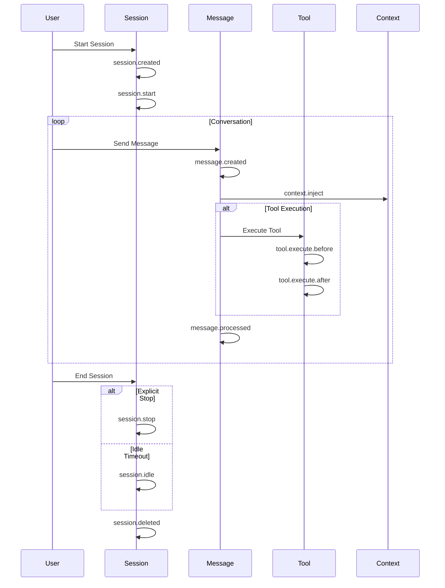

# OpenCode Hook Architecture

## Overview

The OpenCode Hook System provides a powerful event-driven mechanism for extending and customizing OpenCode's behavior throughout the development lifecycle. Hooks allow plugins, agents, and custom scripts to intercept and react to key events such as session lifecycle changes, tool executions, message processing, and file system operations.

This architecture is inspired by the Claude Mem hook system, with enhancements for greater granularity, type safety, and OpenCode-specific capabilities.

---

## Hook Lifecycle

The following diagram illustrates the complete hook lifecycle within a typical OpenCode session:

```
┌─────────────────────────────────────────────────────────────────────────────┐
│                         HOOK LIFECYCLE FLOW                                 │
├─────────────────────────────────────────────────────────────────────────────┤
│                                                                             │
│   USER                                                                      │
│    │                                                                        │
│    ▼                                                                        │
│  ┌─────────────────┐                                                        │
│  │ session.created │  ←── Session initialization, context loading          │
│  └────────┬────────┘                                                        │
│           │                                                                 │
│           ▼                                                                 │
│  ┌─────────────────┐                                                        │
│  │ session.start   │  ←── User prompt submission begins                     │
│  └────────┬────────┘                                                        │
│           │                                                                 │
│    ╔═══════════════════════════════════════════════════════════════════╗    │
│    ║  CONVERSATION LOOP (repeats for each message)                     ║    │
│    ║                                                                   ║    │
│    ║  ┌─────────────────┐                                             ║    │
│    ║  │ message.created │  ←── User message received                   ║    │
│    ║  └────────┬────────┘                                             ║    │
│    ║           │                                                      ║    │
│    ║           ▼                                                      ║    │
│    ║  ┌─────────────────┐     ┌─────────────────┐                     ║    │
│    ║  │ context.inject  │ ←── │ Tool calls      │                     ║    │
│    ║  └────────┬────────┘     └────────┬────────┘                     ║    │
│    ║           │                        │                             ║    │
│    ║           ▼                        ▼                             ║    │
│    ║  ┌─────────────────┐     ┌─────────────────┐                     ║    │
│    ║  │ tool.execute.   │ ←── │ tool.execute.   │  ←── BEFORE tool    ║    │
│    ║  │     before      │     │     after       │  ←── AFTER tool     ║    │
│    ║  └─────────────────┘     └─────────────────┘                     ║    │
│    ║                                                                   ║    │
│    ║  ┌─────────────────┐                                             ║    │
│    ║  │ message.processed│ ←── Message processing complete            ║    │
│    ║  └─────────────────┘                                             ║    │
│    ╚═══════════════════════════════════════════════════════════════════╝    │
│           │                                                                 │
│           │ (session ends)                                                │
│           ▼                                                                 │
│  ┌─────────────────┐     ┌─────────────────┐                               │
│  │   session.stop  │ ←── │  session.idle   │  ←── Explicit or timeout    │
│  └────────┬────────┘     └─────────────────┘                               │
│           │                                                                 │
│           ▼                                                                 │
│  ┌─────────────────┐                                                        │
│  │ session.deleted │  ←── Cleanup and final persistence                   │
│  └─────────────────┘                                                        │
│                                                                             │
└─────────────────────────────────────────────────────────────────────────────┘
```

### Mermaid Diagram



---

## Available Hooks

### Session Lifecycle Hooks

#### `session.created`
**Purpose**: Triggered when a new session is initialized

**Timing**: 
- Before any user interaction
- After project context is loaded
- Before context injection

**Use Cases**:
- Initialize memory systems
- Load historical context
- Set up session metadata
- Check dependencies

**Input**: `SessionHookInput`
```typescript
{
  sessionId: string;
  project: string;
  directory: string;
  timestamp: Date;
  metadata?: SessionMetadata;
}
```

**Output**: `SessionHookOutput`
```typescript
{
  session?: SessionContext;
  success: boolean;
  error?: string;
}
```

---

#### `session.start`
**Purpose**: Triggered when the user submits their first prompt

**Timing**:
- After `session.created`
- Before `message.created` for first message
- Context injection point

**Use Cases**:
- Display welcome messages
- Inject initial context
- Validate session configuration
- Log session start

---

#### `session.idle`
**Purpose**: Triggered when a session has been inactive for a configured timeout period

**Timing**:
- After idle timeout (default: 30 minutes)
- Before `session.stop` if stop is triggered
- Can generate checkpoint summaries

**Use Cases**:
- Generate session summaries
- Persist intermediate state
- Trigger background processing
- Notify monitoring systems

---

#### `session.stop`
**Purpose**: Triggered when a session is explicitly terminated by the user or system

**Timing**:
- User-initiated stop
- System termination
- NOT triggered by idle timeout

**Use Cases**:
- Generate final session summary
- Mark session as stopped (not completed)
- Trigger outbox drain
- User notifications
- Cleanup resources

**Claude Mem Comparison**: Equivalent to Claude's `Stop` lifecycle event

---

#### `session.deleted`
**Purpose**: Triggered when a session is permanently removed

**Timing**:
- After session data is deleted
- Final cleanup opportunity

**Use Cases**:
- Cleanup temporary files
- Remove session-specific resources
- Update analytics
- Archive data if needed

---

### Tool Execution Hooks

#### `tool.execute.before`
**Purpose**: Triggered before a tool is executed

**Timing**:
- After tool arguments are prepared
- Before actual tool execution
- Can modify arguments or skip execution

**Use Cases**:
- Validate tool arguments
- Log tool calls
- Modify arguments
- Check permissions
- Inject context

**Input**: `ToolHookInput`
```typescript
{
  tool: string;
  callId: string;
  args: Record<string, unknown>;
  sessionId: string;
  timestamp: Date;
  callIndex: number;
}
```

**Output**: `ToolHookOutput`
```typescript
{
  result: unknown;
  durationMs: number;
  success: boolean;
  error?: ToolError;
  outputSize?: number;
}
```

---

#### `tool.execute.after`
**Purpose**: Triggered after a tool completes execution

**Timing**:
- After tool execution completes
- Before result is returned to the model
- Has access to full output

**Use Cases**:
- Capture tool output as observations
- Log results
- Transform output
- Track performance
- Update session state

---

### Message Processing Hooks

#### `message.created`
**Purpose**: Triggered when a new message is created (user or assistant)

**Timing**:
- After message is received
- Before processing begins
- Single source of truth for prompt capture

**Use Cases**:
- Capture prompts
- Log conversations
- Analyze content
- Inject context
- Pre-processing

**Input**: `MessageHookInput`
```typescript
{
  content: string;
  role: 'user' | 'assistant' | 'system';
  timestamp: Date;
  sessionId: string;
  messageId: string;
  index: number;
  tokenCount?: number;
}
```

---

#### `message.processed`
**Purpose**: Triggered after a message has been fully processed

**Timing**:
- After model response generation
- After all tool calls complete
- Final message state

**Use Cases**:
- Post-processing
- Update conversation state
- Generate embeddings
- Persist to storage
- Analytics

---

#### `chat.message` (Legacy/Deprecated)
**Status**: Placeholder/deprecated - use `message.created` instead

**Note**: This hook exists for backward compatibility but `message.created` is the preferred and more comprehensive alternative.

---

### Context Injection Hooks

#### `context.inject`
**Purpose**: Triggered to gather and inject context into the conversation

**Timing**:
- At session start
- Before each user message (if configured)
- When context refresh is needed

**Use Cases**:
- Retrieve relevant memories
- Load file context
- Query external knowledge
- Build context manifest

**Input**: `ContextInjectionInput`
```typescript
{
  session: SessionHookInput;
  conversationHistory?: MessageHookInput[];
  availableSources: ContextSource[];
  maxContextLength: number;
}
```

**Output**: `ContextInjectionOutput`
```typescript
{
  contextToInject: string;
  observations: ContextObservation[];
  totalSize: number;
  sourcesUsed: string[];
  success: boolean;
}
```

---

### File System Hooks

#### `file.watcher.updated`
**Purpose**: Triggered when a file is modified

**Timing**:
- After file change is detected
- Rate-limited to prevent spam
- Filtered by ignore patterns

**Use Cases**:
- Track code changes
- Update file observations
- Trigger re-indexing
- Dependency tracking

**Input**: `FileWatcherInput`
```typescript
{
  path: string;
  event: 'created' | 'updated' | 'deleted' | 'renamed';
  timestamp: Date;
  contentHash?: string;
  sessionId: string;
}
```

---

#### `file.watcher.created`
**Purpose**: Triggered when a new file is created

---

#### `file.watcher.deleted`
**Purpose**: Triggered when a file is deleted

---

## Hook Execution Order and Timing

### Execution Sequence

```
┌─────────────────────────────────────────────────────────────────┐
│                    HOOK EXECUTION ORDER                          │
├─────────────────────────────────────────────────────────────────┤
│                                                                  │
│  1. session.created                                              │
│     └── Priority hooks first (lower number)                      │
│     └── Parallel execution within same priority                  │
│                                                                  │
│  2. session.start                                                │
│     └── Runs sequentially based on registration order            │
│                                                                  │
│  3. message.created                                              │
│     └── Blocking: Can modify message before processing           │
│                                                                  │
│  4. context.inject                                               │
│     └── Async: Non-blocking, injects context                     │
│                                                                  │
│  5. tool.execute.before                                          │
│     └── Blocking: Can modify or cancel tool execution            │
│                                                                  │
│  6. [TOOL EXECUTES]                                              │
│                                                                  │
│  7. tool.execute.after                                           │
│     └── Async: Captures results, non-blocking                    │
│                                                                  │
│  8. message.processed                                            │
│     └── Async: Post-processing                                   │
│                                                                  │
│  9. session.idle / session.stop                                  │
│     └── Async: Summary generation, persistence                   │
│                                                                  │
│  10. session.deleted                                             │
│     └── Cleanup, resource release                                │
│                                                                  │
└─────────────────────────────────────────────────────────────────┘
```

### Timing Characteristics

| Hook | Blocking | Timeout | Typical Duration |
|------|----------|---------|------------------|
| `session.created` | Yes | 5s | 10-50ms |
| `session.start` | Yes | 5s | 5-20ms |
| `session.idle` | No | 30s | 100-500ms |
| `session.stop` | No | 30s | 100-500ms |
| `session.deleted` | No | 10s | 5-50ms |
| `message.created` | Yes | 2s | 1-10ms |
| `message.processed` | No | 10s | 5-20ms |
| `tool.execute.before` | Yes | 1s | <1ms |
| `tool.execute.after` | No | 10s | 5-50ms |
| `context.inject` | Yes | 5s | 20-100ms |
| `file.watcher.*` | No | 5s | 1-10ms |

---

## Input/Output Schemas

### Standard Input Fields

All hook inputs include:
- `timestamp`: When the event occurred
- `sessionId`: Reference to the current session

### Standard Output Fields

All hook outputs include:
- `success`: Whether the hook completed successfully
- `durationMs`: Execution time in milliseconds

### Type Safety

All hooks are fully typed with TypeScript:

```typescript
import type { 
  OpenCodeHook, 
  SessionHookInput, 
  SessionHookOutput 
} from '~/universal/hooks'

const myHook: OpenCodeHook<SessionHookInput, SessionHookOutput> = {
  name: 'session.created',
  handler: async (input, output) => {
    // TypeScript ensures input.sessionId, input.project, etc.
    // are all properly typed
  }
}
```

---

## Best Practices

### 1. Non-Blocking Design

**Rule**: Hooks should never block the main execution flow

**Good**:
```typescript
{
  name: 'tool.execute.after',
  handler: async (input, output) => {
    // Fire-and-forget observation creation
    createObservation(input, output).catch(err => {
      logger.error('Failed to create observation', err)
    })
  }
}
```

**Bad**:
```typescript
{
  name: 'tool.execute.after',
  handler: async (input, output) => {
    // Blocking call - delays tool result!
    await createObservation(input, output)
  }
}
```

### 2. Error Handling

**Rule**: Hooks should handle their own errors and never throw

**Good**:
```typescript
{
  name: 'session.created',
  handler: async (input, output) => {
    try {
      await initializeMemory()
    } catch (err) {
      // Log but don't throw - session should continue
      logger.warn('Memory init failed, continuing without', err)
    }
  }
}
```

**Bad**:
```typescript
{
  name: 'session.created',
  handler: async (input, output) => {
    // Uncaught error could crash the session!
    await initializeMemory()
  }
}
```

### 3. Timeouts

**Rule**: Respect timeout limits based on hook type

```typescript
{
  name: 'tool.execute.after',
  priority: 100,
  handler: async (input, output) => {
    // Use AbortController for fetch operations
    const controller = new AbortController()
    const timeout = setTimeout(() => controller.abort(), 8000)
    
    try {
      await fetch(url, { signal: controller.signal })
    } finally {
      clearTimeout(timeout)
    }
  }
}
```

### 4. Idempotency

**Rule**: Hooks should be idempotent - safe to run multiple times

```typescript
{
  name: 'session.created',
  handler: async (input, output) => {
    // Check if already initialized
    if (sessionStore.has(input.sessionId)) {
      return
    }
    
    await initializeSession(input)
    sessionStore.add(input.sessionId)
  }
}
```

### 5. Minimal Processing

**Rule**: Do only what's necessary in hooks

```typescript
{
  name: 'tool.execute.after',
  handler: async (input, output) => {
    // Extract only what you need
    const observation = {
      tool: input.tool,
      summary: summarizeResult(output.result), // Don't store full output
      timestamp: input.timestamp
    }
    
    queueForPersistence(observation) // Async, non-blocking
  }
}
```

---

## Comparison with Claude Mem Hooks

### Feature Parity Matrix

| Feature | Claude Mem | OpenCode | Status |
|---------|------------|----------|--------|
| Session lifecycle | ✅ | ✅ | **Parity** |
| Tool before/after | ✅ | ✅ | **Parity** |
| Message hooks | ✅ | ✅ | **Parity** |
| Context injection | ✅ | ✅ | **Parity** |
| `session.stop` event | ✅ | ✅ | **Parity** |
| File watcher hooks | ❌ | ✅ | **OpenCode+** |
| Typed interfaces | ❌ | ✅ | **OpenCode+** |
| Priority system | ⚠️ Limited | ✅ Full | **OpenCode+** |
| Performance monitoring | ✅ | ✅ | **Parity** |
| Configurable timeouts | ⚠️ | ✅ | **OpenCode+** |

### Key Differences

#### 1. Type Safety

**Claude Mem**:
```typescript
// Untyped, potential runtime errors
"session.created": async (input: any, output: any) => {
  input.sesionId // Typo - no error at compile time
}
```

**OpenCode**:
```typescript
// Fully typed
import type { SessionHookInput, SessionHookOutput } from '~/universal/hooks'

const hook: OpenCodeHook<SessionHookInput, SessionHookOutput> = {
  name: 'session.created',
  handler: async (input, output) => {
    input.sessionId // ✅ Autocomplete and type checking
    input.sesionId  // ❌ TypeScript error
  }
}
```

#### 2. Hook Priority

**Claude Mem**: Basic sequential execution
**OpenCode**: Priority-based with parallelization

```typescript
// OpenCode priority system
const criticalHook = {
  name: 'session.created',
  priority: 1,  // Runs first
  handler: async () => { /* ... */ }
}

const optionalHook = {
  name: 'session.created',
  priority: 100,  // Runs later
  handler: async () => { /* ... */ }
}
```

#### 3. File System Hooks

**Claude Mem**: Not available
**OpenCode**: Full file watcher integration

```typescript
// Track code changes automatically
{
  name: 'file.watcher.updated',
  handler: async (input, output) => {
    if (input.path.endsWith('.ts')) {
      await updateTypeIndex(input.path)
    }
  }
}
```

#### 4. Performance Monitoring

**Claude Mem**: Debug logging only
**OpenCode**: Built-in performance tracking

```typescript
// Automatic performance metrics
interface HookPerformanceStats {
  hookName: string
  avgDurationMs: number
  p95DurationMs: number
  errorCount: number
}
```

---

## Configuration

### Hook Configuration File

```json
// .opencode/hook-config.json
{
  "defaultTimeoutMs": 5000,
  "performanceMonitoring": true,
  "debugLogging": false,
  "hooks": {
    "session.created": {
      "enabled": true,
      "options": {
        "contextInjection": true,
        "contextObservationLimit": 50,
        "showUserMessage": true
      },
      "timeoutMs": 10000,
      "logErrors": true
    },
    "tool.execute.after": {
      "enabled": true,
      "options": {
        "skipTools": ["Read", "List"],
        "maxContentSize": 50000,
        "captureTiming": true
      },
      "timeoutMs": 15000
    },
    "session.idle": {
      "enabled": true,
      "options": {
        "timeoutMinutes": 30,
        "generateSummary": true
      },
      "timeoutMs": 60000
    }
  }
}
```

### Environment Variables

```bash
# Enable debug logging for all hooks
OPENCODE_HOOK_DEBUG=true

# Disable specific hooks
OPENCODE_DISABLE_HOOKS=session.idle,file.watcher.updated

# Performance monitoring
OPENCODE_HOOK_PERFORMANCE=true
```

---

## Troubleshooting

### Hook Not Firing

1. Check if hook is enabled in configuration
2. Verify hook name matches exactly (case-sensitive)
3. Check if hook is registered before the event occurs
4. Review logs for registration errors

### Performance Issues

1. Check hook execution times in logs
2. Reduce hook priority if order doesn't matter
3. Use non-blocking patterns for async work
4. Consider disabling expensive hooks during development

### Type Errors

1. Import correct types from `~/universal/hooks`
2. Ensure handler signature matches `OpenCodeHook<TInput, TOutput>`
3. Use type guards for runtime validation

---

## See Also

- [Writing Custom Hooks](../guides/writing-hooks.md) - Step-by-step guide
- [Hook Interface Reference](../../universal/hooks/interface.ts) - Type definitions
- [Claude Mem Parity Plan](../../CLAUDE_MEM_PARITY_PLAN.md) - Full comparison
